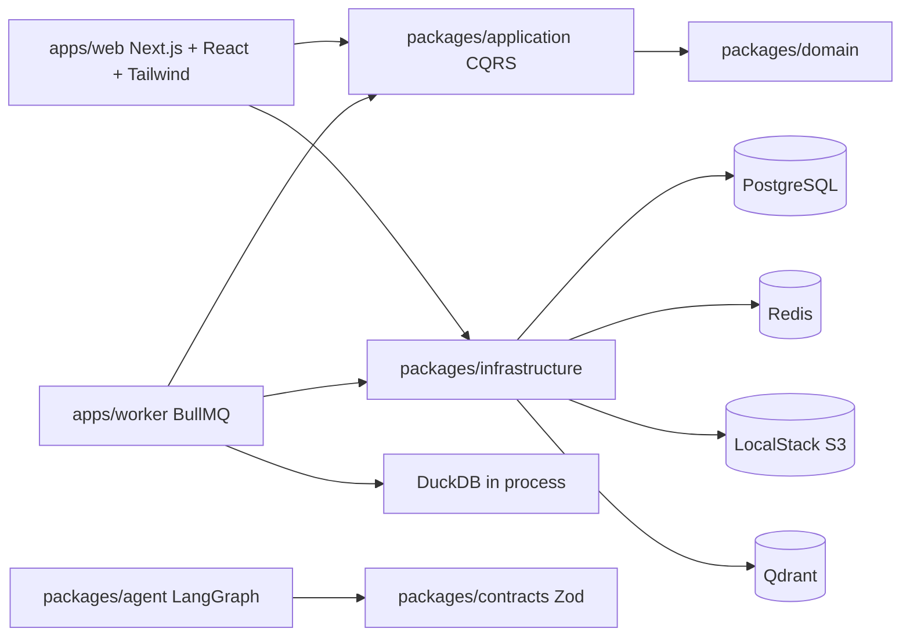

# Agentic CSV Analyst

Production-minded implementation of an Agentic CSV Analyst. The product direction is:

> The LLM plans and explains. Deterministic tools calculate. RAG retrieves semantic
> context.

The foundation and secure direct CSV upload workflow are implemented. Dataset profiling,
RAG indexing, and conversational analysis remain specification-driven follow-up work.

## Architecture



Dependency direction:

```text
Domain <- Application <- Infrastructure <- Web / Worker
```

## Repository Map

- `apps/web`: Next.js App Router UI, health/readiness routes, authenticated dataset APIs,
  CSRF defenses, and rate-limit composition.
- `apps/worker`: BullMQ worker, validated ingestion processor, and transactional outbox
  dispatcher.
- `packages/domain`: dataset aggregate, value objects, domain events, errors.
- `packages/application`: CQRS buses, transactional ports, and CSV upload workflow.
- `packages/contracts`: shared Zod API, queue, dataset, and agent contracts.
- `packages/infrastructure`: env, Drizzle, Redis, BullMQ, S3, Qdrant, DuckDB, logging,
  rate limiting, readiness.
- `packages/agent`: LangGraph state and placeholder analysis graph.
- `knowledge-base`: version-controlled policies, glossary, and example documents.
- `specs`: approved product contracts plus an explicit implemented/planned status map.
- `docs/adr`: architecture decision records.

## Prerequisites

- Node.js 22 or newer.
- Corepack.
- Docker with Compose v2 for local infrastructure and containerized execution.

## First Run

```bash
corepack enable
cp .env.example .env
cp docker/.env.example docker/.env
cp docker/docker-compose.yml.example docker/docker-compose.yml
pnpm install
pnpm env:check
pnpm format:check
pnpm lint
pnpm typecheck
pnpm test
pnpm test:integration
pnpm build
```

Use `.env` as the project-level source of truth. Docker-only overrides live in
`docker/.env`. Both local files and the rendered Compose file are ignored; their tracked
examples are the reset source.

## Infrastructure-Only Development

```bash
pnpm infra:up
pnpm db:migrate
pnpm auth:key:create --user-name "Local developer"
pnpm infra:down
```

Local service URLs:

- PostgreSQL: `localhost:5432`
- Redis: `localhost:6379`
- Qdrant REST/dashboard: `http://localhost:6333`
- Qdrant gRPC: `localhost:6334`
- LocalStack: `http://localhost:4566`

## Frontend Development

The frontend lives in `apps/web`. It uses React through Next.js App Router and
Tailwind CSS v4 for styling.

```bash
pnpm --filter @agentic-csv/web dev
```

The package-level dev script uses port `3000`. If that port is already busy, run:

```bash
pnpm --filter @agentic-csv/web exec next dev --port 3001
```

## Fully Containerized Workflow

The local Compose file is `docker/docker-compose.yml`, created from its tracked example.
Root scripts already pass that path.

Validate Compose:

```bash
docker compose --env-file .env -f docker/docker-compose.yml --profile app config
```

Build application images (the worker image also runs the one-shot migration service):

```bash
docker compose --env-file .env -f docker/docker-compose.yml --profile app build web worker
```

Build and run full stack:

```bash
docker compose --env-file .env -f docker/docker-compose.yml --profile app up -d --build
docker compose --env-file .env -f docker/docker-compose.yml --profile app ps
docker compose --env-file .env -f docker/docker-compose.yml --profile app logs -f --tail=200
```

The `migrate` service applies committed Drizzle migrations after PostgreSQL becomes healthy. Web
and worker processes start only after migration succeeds.

Stop while preserving data:

```bash
docker compose --env-file .env -f docker/docker-compose.yml --profile app down
```

Reset all local data:

```bash
docker compose --env-file .env -f docker/docker-compose.yml --profile app down -v --remove-orphans
```

## Health and Readiness

- Liveness: `GET http://localhost:3000/api/health`
- Readiness: `GET http://localhost:3000/api/ready`

`/api/health` only confirms the web process is alive. `/api/ready` checks PostgreSQL,
Redis, Qdrant, and S3/LocalStack and returns HTTP 503 if a dependency is unavailable.

## Object Storage

The intended upload pattern is direct-to-S3 through presigned URLs. Large CSV bodies
should not be proxied through Next.js request handlers.

LocalStack creates the development bucket from `docker/localstack/init`.

## Authentication and CSV Upload API

The current API-first compatibility slice uses opaque bearer API keys. Only an HMAC of each key is stored in PostgreSQL;
the plaintext is printed once by the creation command. API keys are appropriate for this
API-first slice. Phase 2 replaces browser use with persisted, revocable cookie sessions and
email/password authentication. Bearer keys remain server/CLI credentials and must not be stored by the browser.

After applying migrations, create a user and API key:

```bash
pnpm auth:key:create --user-name "Local developer" --key-name "local-cli"
export CSV_API_KEY='the-key-printed-once'
```

Mutation endpoints require `Authorization: Bearer ...`, `Content-Type: application/json`,
and same-origin browser requests. Upload completion additionally requires an
`Idempotency-Key` header.

```text
POST /api/v1/datasets
POST /api/v1/datasets/{datasetId}/upload
POST /api/v1/datasets/{datasetId}/upload/complete
```

Upload initiation requires the exact byte size, content type, and base64 SHA-256 checksum.
The returned `PUT` URL must be called with every returned `requiredHeaders` entry. Completion
verifies S3 size, media type, checksum, user, dataset, and version metadata before atomically
changing dataset/version state and writing the versioned ingestion request to the outbox. New
objects use `users/{userId}/datasets/{datasetId}/versions/{versionId}/original.csv`.

## Environment Strategy

Raw environment parsing is centralized in `packages/infrastructure/src/config/env.ts`.
Empty development API keys are allowed where integrations are not invoked. `AUTH_SECRET`
must meet the configured minimum length. Compose overrides host URLs with Docker-internal
service names.

`MIGRATION_DATABASE_URL` uses the schema-owning migration role. `DATABASE_URL` uses the
non-owner `agentic_csv_app` role so forced RLS policies remain effective. Existing development
volumes created before this split must be intentionally reset with `pnpm docker:reset` before the
new role can be initialized; that command deletes local database and object-storage data.

## Quality Commands

```bash
pnpm format
pnpm format:check
pnpm lint
pnpm typecheck
pnpm test
pnpm test:integration
pnpm test:coverage
pnpm build
pnpm quality
pnpm quality:integration
```

## Specification Workflow

Start with `specs/000-constitution.md`, then `specs/019-implementation-plan.md` and the
relevant feature contract. `specs/README.md` records what is implemented versus planned.
The superseded foundation/upload/profiling documents remain available in Git history.

## Design Constraints

- Do not put business logic in route handlers.
- Do not import infrastructure from domain.
- Validate API, queue, environment, and agent boundaries with Zod.
- Do not use in-memory queues or rate limiting as the production implementation.
- Do not replace Qdrant with pgvector.
- Do not execute arbitrary model-generated SQL.
- Do not run long ingestion or profiling jobs in web requests.
- Never interpolate user input into SQL. Use validated contracts and parameterized Drizzle
  queries.

## Deferred Work

- CSV profiling and DuckDB analytical execution.
- Interactive email/password authentication and persisted browser sessions.
- RAG ingestion and Qdrant document indexing.
- Production LLM prompts and chart validation.
