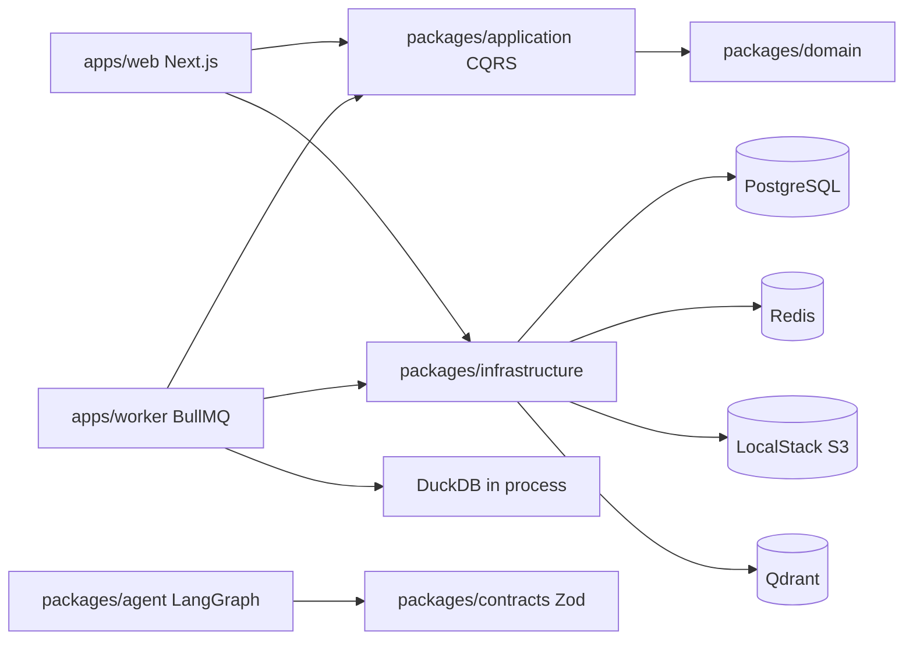

# Agentic CSV Analyst

Production-minded foundation for an Agentic CSV Analyst. The product direction is:

> The LLM plans and explains. Deterministic tools calculate. RAG retrieves semantic
> context.

This repository currently implements the foundation phase only. CSV upload, ingestion,
profiling, RAG indexing, and conversational analysis are intentionally deferred to later
specifications.

## Architecture



Dependency direction:

```text
Domain <- Application <- Infrastructure <- Web / Worker
```

## Repository Map

- `apps/web`: Next.js App Router UI and `/api/health`, `/api/ready`.
- `apps/worker`: BullMQ worker process and dataset ingestion processor scaffold.
- `packages/domain`: dataset aggregate, value objects, domain events, errors.
- `packages/application`: CQRS buses, ports, and initial dataset command.
- `packages/contracts`: shared Zod API, queue, dataset, and agent contracts.
- `packages/infrastructure`: env, Drizzle, Redis, BullMQ, S3, Qdrant, DuckDB, logging,
  rate limiting, readiness.
- `packages/agent`: LangGraph state and placeholder analysis graph.
- `knowledge-base`: version-controlled policies, glossary, and example documents.
- `specs`: constitution, foundation spec, and next CSV upload spec.
- `docs/adr`: architecture decision records.

## Prerequisites

- Node.js 22 or newer.
- Corepack.
- Docker with Compose v2 for local infrastructure and containerized execution.

## First Run

```bash
corepack enable
pnpm install
pnpm env:check
pnpm format:check
pnpm lint
pnpm typecheck
pnpm test
pnpm build
```

Use `.env` as the project-level source of truth. Start from `.env.example` when
resetting local values. Docker-only overrides live in `docker/.env`; start from
`docker/.env.example` when resetting those values. Both `.env` files are ignored.

## Infrastructure-Only Development

```bash
pnpm infra:up
pnpm db:generate
pnpm db:migrate
pnpm infra:down
```

Local service URLs:

- PostgreSQL: `localhost:5432`
- Redis: `localhost:6379`
- Qdrant REST/dashboard: `http://localhost:6333`
- Qdrant gRPC: `localhost:6334`
- LocalStack: `http://localhost:4566`

## Fully Containerized Workflow

The canonical Compose file is `docker/docker-compose.yml`. Root scripts already pass
that path. `docker-compose.yml.example` is an optional wrapper if you want root-level
Compose auto-discovery.

Validate Compose:

```bash
docker compose --env-file .env -f docker/docker-compose.yml --profile app config
```

Build application images:

```bash
docker compose --env-file .env -f docker/docker-compose.yml --profile app build web worker
```

Build and run full stack:

```bash
docker compose --env-file .env -f docker/docker-compose.yml --profile app up -d --build
docker compose --env-file .env -f docker/docker-compose.yml --profile app ps
docker compose --env-file .env -f docker/docker-compose.yml --profile app logs -f --tail=200
```

Stop while preserving data:

```bash
docker compose --env-file .env -f docker/docker-compose.yml --profile app down
```

Reset all local data:

```bash
docker compose --env-file .env -f docker/docker-compose.yml --profile app down -v --remove-orphans
```

## Health and Readiness

- Liveness: `GET http://localhost:3000/api/health`
- Readiness: `GET http://localhost:3000/api/ready`

`/api/health` only confirms the web process is alive. `/api/ready` checks PostgreSQL,
Redis, Qdrant, and S3/LocalStack and returns HTTP 503 if a dependency is unavailable.

## Object Storage

The intended upload pattern is direct-to-S3 through presigned URLs. Large CSV bodies
should not be proxied through Next.js request handlers.

LocalStack creates the development bucket from `docker/localstack/init`.

## Environment Strategy

Raw environment parsing is centralized in `packages/infrastructure/src/config/env.ts`.
Empty development API keys are allowed where integrations are not invoked. `AUTH_SECRET`
must meet the configured minimum length. Compose overrides host URLs with Docker-internal
service names.

## Quality Commands

```bash
pnpm format
pnpm format:check
pnpm lint
pnpm typecheck
pnpm test
pnpm test:coverage
pnpm build
pnpm ci
```

## Specification Workflow

Start with `specs/constitution.md`, then read the active feature spec. Foundation work is
tracked in `specs/000-foundation`. The next implementation target is
`specs/001-csv-upload/spec.md`.

## Design Constraints

- Do not put business logic in route handlers.
- Do not import infrastructure from domain.
- Validate API, queue, environment, and agent boundaries with Zod.
- Do not use in-memory queues or rate limiting as the production implementation.
- Do not replace Qdrant with pgvector.
- Do not execute arbitrary model-generated SQL.
- Do not run long ingestion or profiling jobs in web requests.

## Deferred Work

- Real authentication and ownership source.
- CSV upload API and presigned upload flow.
- Upload completion and ingestion enqueueing.
- CSV profiling and DuckDB analytical execution.
- RAG ingestion and Qdrant document indexing.
- Production LLM prompts and chart validation.
