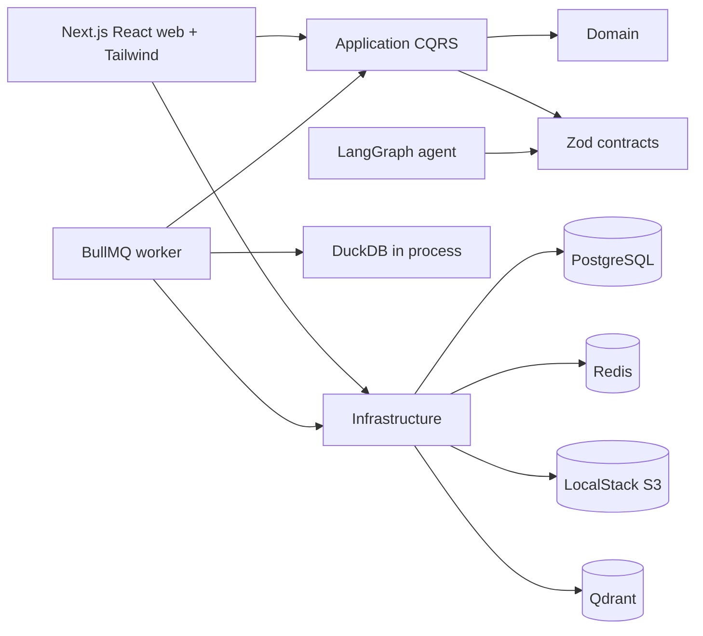

# Architecture

## Summary

Agentic CSV Analyst is a modular monolith with separate web and worker processes.
Business rules live in package boundaries rather than route handlers.

## Boundaries

- Domain contains entities, value objects, domain events, and domain errors.
- Application contains CQRS abstractions, handlers, and ports.
- Infrastructure implements ports and owns external clients.
- Web and worker compose dependencies for delivery.
- Contracts are framework-neutral Zod schemas.
- Agent contains LangGraph state and graph composition only.

`pnpm architecture:check` enforces allowed workspace dependencies, prevents framework and
infrastructure imports in the domain/application layers, and rejects relative imports that cross package
boundaries. It is part of `pnpm quality`; an intentional boundary change requires an ADR and a matching
checker update.

Feature contexts are added when their owning phase introduces real behavior. The current conformance and
next context are tracked in [`implementation.md`](./implementation.md).

## Frontend Layer

`apps/web` is a React frontend delivered through Next.js App Router. It uses Server Components by
default, keeps route handlers thin, and uses Tailwind CSS for application styling. Frontend work is
component-driven: routes compose feature components, shared primitives live in `src/components/ui`, and
feature components live in named folders under `src/components`.

shadcn/ui is the preferred source for accessible primitives. Components are added only when an active
feature requires them and remain repository-owned source rather than an opaque runtime framework. Client
Components are limited to the smallest interactive boundary; business and authorization rules stay in
the domain/application layers.

## Liveness and Readiness

`GET /api/health` checks only whether the web process is alive.

`GET /api/ready` checks PostgreSQL, Redis, Qdrant, and S3/LocalStack. It returns a
structured body with dependency names and statuses. It must not include credentials,
signed URLs, raw connection strings, API keys, or passwords.

## Web and Worker Processes

Web requests should stay short. Ingestion, profiling, embedding, and outbox publishing
belong in queues. The worker validates every job payload before doing work and shuts
down cleanly on `SIGTERM` and `SIGINT`.

## Identity and Request Security

Browser users authenticate with email/password and persisted opaque sessions. Passwords use centrally
configured Argon2id. PostgreSQL stores only keyed hashes of session, CSRF, verification, reset, and API
tokens. The browser receives the session token only through a secure HTTP-only SameSite cookie; session
identifiers never appear in URLs.

Cookie-authenticated mutations require JSON, a trusted Origin/Referer, and a session-bound CSRF token.
CSRF refresh rotates the stored hash, making an earlier token fail on replay. Sessions enforce idle and
absolute expiry, support targeted revocation, and rotate after login, password changes, and sensitive
re-authentication. Public authentication and recovery operations use enumeration-safe bodies plus hashed
IP, identifier, and account rate-limit buckets.

Opaque bearer API keys remain a compatibility credential for CLI/server clients. PostgreSQL stores only
their HMAC and resolves it to a user ID. Browser code never stores or uses these keys.

Redis applies a global pre-authentication ceiling, a credential-bucket limit, and a user-scoped
limit. The global ceiling bounds invalid-key rotation while the credential limit contains one key.
AI routes use the separately configured stricter policy. Protection fails closed when Redis cannot
initialize.

Zod validates external shapes and Drizzle parameterizes relational queries. User input is
never concatenated into SQL. Future analytical SQL has a separate read-only, allow-listed
contract defined by the profiling specification.

## Upload Transaction

Upload initiation creates an expiring intent containing the expected S3 key, byte size,
media type, and checksum. Completion verifies the stored object before a PostgreSQL
transaction locks user-scoped records. Dataset state, domain events, upload completion,
idempotency response, and an ingestion outbox event commit together. The worker publishes
that outbox event to BullMQ with a deterministic job ID, so a crash between enqueue and
outbox acknowledgement does not create duplicate work.

## DuckDB Placement

DuckDB is embedded in the worker because it is an in-process analytical engine, not a
network database service. The worker can create isolated temporary databases close to
the CSV processing flow and enforce timeout and result-size controls before returning
results.

## Qdrant and PostgreSQL

PostgreSQL may run with pgvector capability for future optional use, but Qdrant is the
primary vector store. Qdrant keeps retrieval operations, payload filters, and vector
collection lifecycle independent from relational persistence.

## Observability

Pino produces structured logs with service, correlation, queue, job, dataset, and user
fields. Secret-like fields are redacted. CSV contents, API keys, authorization headers,
passwords, and signed URLs must not be logged.

## PostgreSQL Tenant Context

The migration role owns the schema. Web and worker processes use the non-owner
`agentic_csv_app` role. Every application unit of work opens a transaction and sets
`app.current_user_id` transaction-locally before accessing tenant tables. Forced RLS policies
deny access when the setting is absent and filter guessed identifiers even if a repository
predicate is accidentally omitted. API-key authentication is isolated to its dedicated table;
resource access begins only after a user identity has been resolved.
