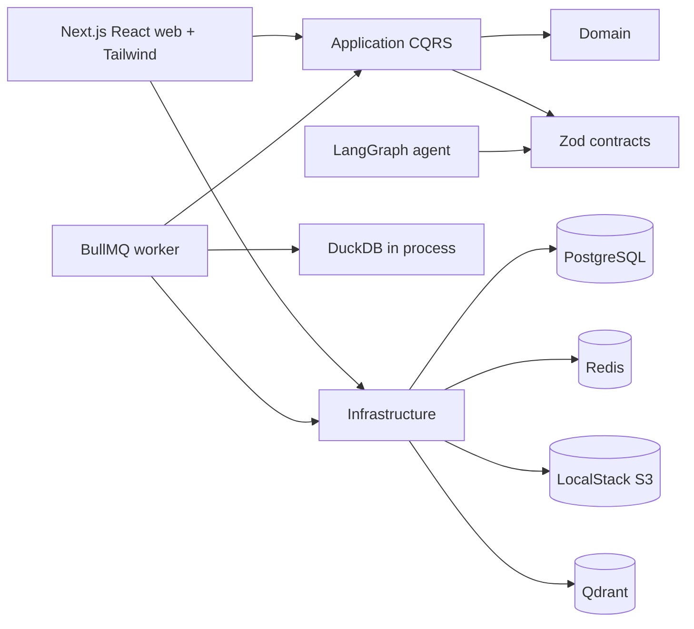

# Architecture

## Summary

Agentic CSV Analyst is a modular monolith with separate web and worker processes.
Business rules live in package boundaries rather than route handlers.

## Boundaries

- Domain contains entities, value objects, domain events, and domain errors.
- Application contains CQRS abstractions, handlers, and ports.
- Infrastructure implements ports and owns external clients.
- Web and worker compose dependencies for delivery.
- Contracts are framework-neutral Zod schemas.
- Agent contains LangGraph state and graph composition only.

## Frontend Layer

`apps/web` is a React frontend delivered through Next.js App Router. It uses Server
Components by default, keeps route handlers thin, and uses Tailwind CSS for application
styling without introducing a component framework.

## Liveness and Readiness

`GET /api/health` checks only whether the web process is alive.

`GET /api/ready` checks PostgreSQL, Redis, Qdrant, and S3/LocalStack. It returns a
structured body with dependency names and statuses. It must not include credentials,
signed URLs, raw connection strings, API keys, or passwords.

## Web and Worker Processes

Web requests should stay short. Ingestion, profiling, embedding, and outbox publishing
belong in queues. The worker validates every job payload before doing work and shuts
down cleanly on `SIGTERM` and `SIGINT`.

## DuckDB Placement

DuckDB is embedded in the worker because it is an in-process analytical engine, not a
network database service. The worker can create isolated temporary databases close to
the CSV processing flow and enforce timeout and result-size controls before returning
results.

## Qdrant and PostgreSQL

PostgreSQL may run with pgvector capability for future optional use, but Qdrant is the
primary vector store. Qdrant keeps retrieval operations, payload filters, and vector
collection lifecycle independent from relational persistence.

## Observability

Pino produces structured logs with service, correlation, queue, job, dataset, and owner
fields. Secret-like fields are redacted. CSV contents, API keys, authorization headers,
passwords, and signed URLs must not be logged.
